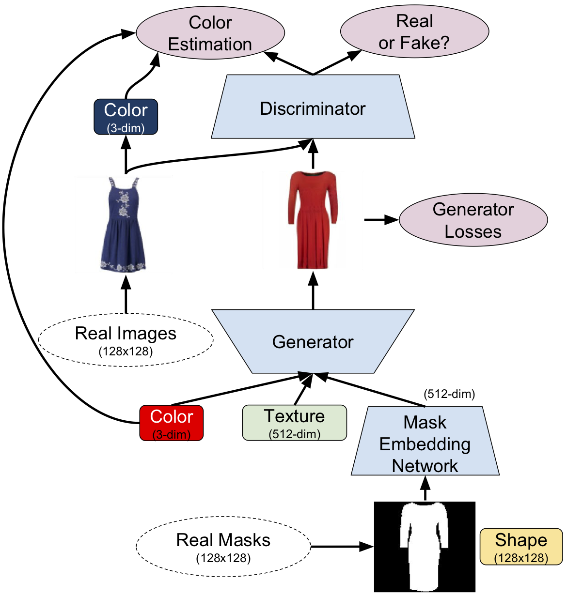
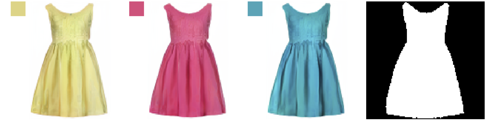
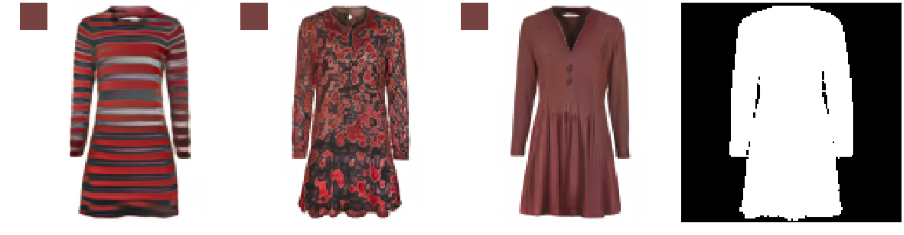
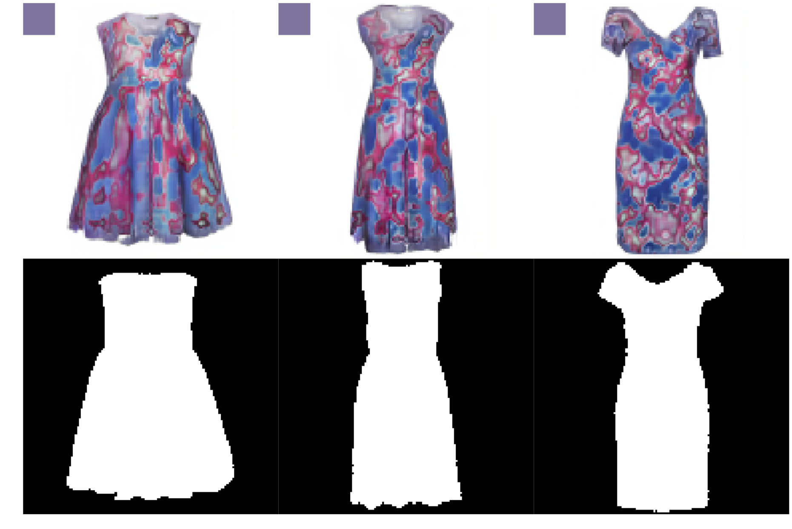

# Disentangling Multiple Conditional Inputs in GANs

This is the Tensorflow implementation of our paper [Disentangling Multiple Conditional Inputs in GANs](https://arxiv.org/abs/1806.07819), which is published in KDD-AI for Fashion Workshop. Our code is tested with Tensorflow 1.8 (Python 3.6). We modified the code from [Progressive Growing of GANs for Improved Quality, Stability, and Variation](https://github.com/tkarras/progressive_growing_of_gans) and used it without progressive growing.

## Overview

The process of fashion design requires extensive amount of knowledge in creation and production of garments. A machine-assisted design approach that combines human experience with deep learning can help designers to rapidly visualize an original garment and can save time on design iteration cycles. 

In this paper, we propose a method that disentangles the effects of multiple input conditions in Generative Adversarial Networks (GANs). In particular, we demonstrate our method in controlling color, texture, and shape of a generated garment image for computer-aided fashion design. The flowchart of our method is as follows:

<p align="center"></p>

## Dataset Creation

Before running the code, please check `dataset_tool.py` and `dataset.py` files and make sure that you modify them for your purposes. Creating and loading the dataset will depend on the task.

In `dataset_tool.py`, you can check how we created an image dataset along with color labels:

[Loading color labels](https://github.com/zalandoresearch/disentangling_conditional_gans/blob/master/dataset_tool.py#L616)

[Adding images and labels](https://github.com/zalandoresearch/disentangling_conditional_gans/blob/master/dataset_tool.py#L622)

In `dataset.py`, you can check how we load our dataset as follows:

[Real images](https://github.com/zalandoresearch/disentangling_conditional_gans/blob/master/dataset.py#L68)

[Real masks](https://github.com/zalandoresearch/disentangling_conditional_gans/blob/master/dataset.py#L78)

[Real color labels](https://github.com/zalandoresearch/disentangling_conditional_gans/blob/master/dataset.py#L89)

## Training

You can adjust the training parameters by modifying the `config.py` file. After that, the training can be performed by running the following code:

```
python train.py
```

## Examples

The main motivation of our paper is to disentangle the effect of conditional GAN inputs on a generated image. In other words, we want the texture and shape of an article to stay the same, when we change the color input (true for all input attributes) Our model has three inputs: color, texture, and shape.

#### Controlling Color (texture and shape are fixed)
<p align="center"></p>

#### Controlling Texture (color and shape are fixed)
<p align="center"></p>

#### Controlling Shape (color and texture are fixed)
<p align="center"></p>


## License
Please make sure to cite/acknowledge our paper, if you use any of the contained code in your own projects or publication.

The MIT License (MIT)

Copyright © 2018 Zalando SE, https://research.zalando.com/

Permission is hereby granted, free of charge, to any person obtaining a copy
of this software and associated documentation files (the "Software"), to deal
in the Software without restriction, including without limitation the rights
to use, copy, modify, merge, publish, distribute, sublicense, and/or sell
copies of the Software, and to permit persons to whom the Software is
furnished to do so, subject to the following conditions:

The above copyright notice and this permission notice shall be included in all
copies or substantial portions of the Software.

THE SOFTWARE IS PROVIDED "AS IS", WITHOUT WARRANTY OF ANY KIND, EXPRESS OR
IMPLIED, INCLUDING BUT NOT LIMITED TO THE WARRANTIES OF MERCHANTABILITY,
FITNESS FOR A PARTICULAR PURPOSE AND NONINFRINGEMENT. IN NO EVENT SHALL THE
AUTHORS OR COPYRIGHT HOLDERS BE LIABLE FOR ANY CLAIM, DAMAGES OR OTHER
LIABILITY, WHETHER IN AN ACTION OF CONTRACT, TORT OR OTHERWISE, ARISING FROM,
OUT OF OR IN CONNECTION WITH THE SOFTWARE OR THE USE OR OTHER DEALINGS IN THE
SOFTWARE.
